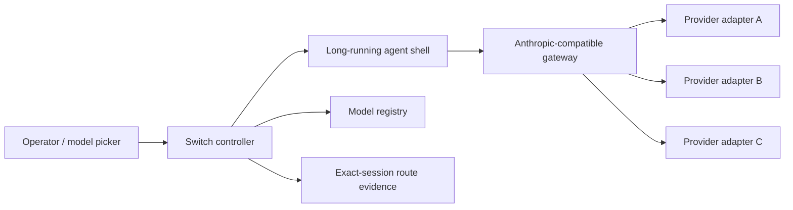

# Same-Session Model Switching

> Keep the shell, transcript, tools, and workspace. Replace only the model backend.

[简体中文](README.zh-CN.md) · [Live minimal](examples/live-minimal/README.md) · [Support matrix](SUPPORT.md) · [Implementation guide](docs/implementation-guide.md) · [Context recovery](docs/context-window-recovery.md) · [Subscription vs API](docs/subscription-vs-api.md) · [Architecture](docs/architecture.md)

This repository is a privacy-clean reference architecture and executable control-plane example for switching model backends inside one long-running Claude Code-style session.

It is **not** a credential broker, an OAuth workaround, or a production inference proxy. You bring a gateway/adapter that is authorized to call each provider. This project supplies the state model, evidence rules, failure handling, tests, and a path other builders can reproduce.

## See the value in 60 seconds

Run one command from the repository root:

```sh
python3 reference/http_demo.py
# Windows Python launcher: py -3 reference/http_demo.py
```

It starts an ephemeral loopback bridge, sends real JSON/HTTP requests through `probe → switch → evidence`, switches A → B → A, and then shuts the server down. The receipts keep one exact session ID and show the revision-correlated route evidence used for each commit:

```text
SWITCH revision=1 session=demo-session-001 target=route-b evidence=mock-request-2
SWITCH revision=2 session=demo-session-001 target=route-a evidence=mock-request-4
PASS same_session=true route_sequence=route-a>route-b>route-a transcript_messages=6 workspace_preserved=true transport=http exact_session_evidence=true
```

This is a networked rehearsal, not a commercial-model claim: the included server uses fictional in-memory routes and no credentials. To go live, keep the controller and [`HttpBridge`](reference/http_bridge.py), then replace [`MockBridgeState`](reference/mock_bridge.py) with the three shell/gateway operations in the [live reproduction guide](docs/live-reproduction.md).

When that passes, [`examples/live-minimal`](examples/live-minimal/README.md) adds an explicit, billable A → B → A test using an Anthropic-compatible gateway and the official Claude Code CLI. It defaults to a zero-credential `--check`; only `--live` reads secrets or sends requests.

## What makes it the same session?

The agent shell remains alive and continues to own:

- the exact session ID and visible transcript;
- tool permissions and tool results;
- the working directory and process state;
- compaction and session-level instructions.

Only the backend route changes:



This preserves explicit conversation state. It cannot preserve provider-private reasoning state, server-side threads, or hidden prompt-cache handles.

## The shortest reproducible path

1. Keep Claude Code (or another long-running agent shell) as the session owner.
2. Point the shell at an authorized Anthropic-compatible gateway. Claude Code documents gateway routing through `ANTHROPIC_BASE_URL` and related settings.
3. Implement one thin adapter per provider and declare its real auth mode and capabilities in one registry.
4. Let the controller probe the real route, wait for an idle boundary, request the switch, and verify the route from the exact session.
5. Commit persistent model intent only after verified runtime evidence.

See [the implementation guide](docs/implementation-guide.md) for the complete assembly and [the runnable controller](reference/switch_controller.py) for the transaction semantics.

```sh
python3 reference/http_demo.py
python reference/demo.py
python -m unittest discover -s reference -p "test_*.py"
python scripts/privacy_check.py
```

The demo proves A → B → A with one session ID, one transcript, and one workspace. It performs no network calls. All reference code is standard-library-only; [`HttpBridge`](reference/http_bridge.py) supplies a generic client contract for replacing the demo boundaries with your supported gateway and shell integration.

Expected demo result:

```text
PASS same_session=true route_sequence=route-a>route-b>route-a transcript_messages=6 workspace_preserved=true
```

### Reproducibility boundary

This repository is sufficient to reproduce and test the **same-session control plane**. To reproduce live commercial-model switching, you must also provide:

- an agent shell version that can select the carrier aliases you register;
- an Anthropic-compatible gateway or equivalent shell adapter;
- supported provider credentials for every route;
- an exact-session evidence reader for your shell/gateway versions.

Those four pieces are environment-specific. The repository gives their exact contracts, a generic HTTP bridge client, and acceptance tests, but cannot ship another person's provider entitlement or promise that a consumer OAuth grant is portable. With supported API/provider-key routes, the integration is direct; native subscription routes work only where the provider supports the client or connector.

## Three different things people call “subscription”

| Access shape | Typical integration | Does this consume the product subscription? |
| --- | --- | --- |
| Provider API key | Gateway calls the provider API | Usually no; API billing/quota is separate |
| Native product sign-in | Official CLI/app uses its own OAuth | Yes, when the provider explicitly says so; the grant is not automatically portable |
| Fixed-price plan that issues an API key | Gateway calls a plan-specific endpoint with that key | Yes for that plan, but technically it integrates like an API |

For example, Codex supports ChatGPT sign-in in official Codex clients, Gemini CLI documents Google sign-in and subscription quota, while OpenCode Go provides a plan-specific API key. Those are different authentication products even if all are paid monthly. Read [Subscription vs API](docs/subscription-vs-api.md) before implementing an adapter.

## Non-negotiable invariants

1. A model appearing in `/models` is discovery, not proof that a completion works.
2. `desired`, `actual`, `pending`, and `unavailable` are separate states.
3. Every accepted switch transaction receives a monotonic revision and unique correlation ID; an older or unrelated result cannot override a newer choice.
4. Busy sessions keep only the latest pending request and re-probe expired evidence at dispatch.
5. Runtime truth is causally bound structured evidence: provider, upstream model, transport, request ID, exact session ID, revision, correlation ID, and observation time after the action.
6. A failed switch preserves the previous route. A failed rollback enters `degraded/actual_unknown`; it never reports optimistic success.
7. Current transcript size and required tools are checked against the target route before dispatch.
8. OAuth is used only by the client/adapter for which the provider supports it.

## Evidence levels

| Level | Claim you may make |
| --- | --- |
| `documented` | The protocol and supported authentication path are understood |
| `probeable` | A real minimal completion succeeds through the intended route |
| `switchable` | The live shell changes route without restart and exact-session evidence matches |
| `continuity-verified` | A → B → A preserves transcript, workspace, and busy-session semantics |
| `tool-verified` | Required tool calls and streaming normalization pass |
| `long-context-verified` | The exact alias and route survive realistic long-context tests |

The example registry is fictional and makes no claim that a named commercial route currently works.

## Repository map

- [Implementation guide](docs/implementation-guide.md) — build order and acceptance test
- [Live reproduction path](docs/live-reproduction.md) — how to replace the three demo boundaries
- [Live minimal harness](examples/live-minimal/README.md) — opt-in commercial requests with synthetic data and a secret-free receipt
- [Support and evidence matrix](SUPPORT.md) — exact verified versions, claim levels, and unverified boundaries
- [Changelog](CHANGELOG.md) — versioned public evidence snapshots
- [Subscription vs API](docs/subscription-vs-api.md) — billing/auth boundaries
- [Architecture](docs/architecture.md) — components and data flow
- [Controller reference](reference/switch_controller.py) — executable state machine
- [HTTP bridge client](reference/http_bridge.py) — generic live probe/dispatch/evidence contract
- [Runnable mock bridge](reference/mock_bridge.py) — loopback server for the same HTTP contract
- [HTTP end-to-end demo](reference/http_demo.py) — networked A → B → A rehearsal with evidence receipts
- [Atomic state store](reference/state_store.py) — atomic, non-secret desired-route persistence
- [Runnable demonstration](reference/demo.py) — credential-free A → B → A continuity proof
- [Reference tests](reference) — races, stale evidence, cancellation, persistence, bridge parsing, rollback, and degraded state
- [Adapter contract](docs/adapter-contract.md) — provider-neutral transport contract
- [Session continuity](docs/session-continuity.md) — what crosses a switch
- [Context-window recovery](docs/context-window-recovery.md) — direct switch, pre-switch compact, recovery route, or bounded handoff
- [Failure modes](docs/failure-modes.md) — misleading signals and recovery rules
- [Security](docs/security.md) — credential and publication hygiene
- [Provider checklist](docs/adding-a-provider.md) — evidence ladder
- [Registry example](examples/model-registry.yaml) — non-production schema example

## Scope and license

This project intentionally does not ship provider credentials, private prompts, deployment paths, production logs, or code copied from a private long-running agent system. Documentation and reference code are MIT licensed. Product and model names belong to their owners; this project is not affiliated with or endorsed by them.
