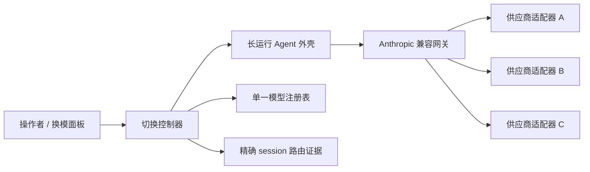

# 同场换模型：保留会话，只换后端

[English](README.md) · [Live minimal](examples/live-minimal/README.md) · [实现指南](docs/implementation-guide.md) · [上下文恢复](docs/context-window-recovery.md) · [订阅与 API](docs/subscription-vs-api.md) · [架构](docs/architecture.md)

这个仓库公开的是一套可复现、已去除私人信息的方案：让 Claude Code 风格的长运行 Agent 外壳继续持有同一个 session、对话、工具和工作区，只切换后端模型。

它**不是**凭据中转站、OAuth 绕过教程或现成生产代理。你需要自行提供被供应商允许的网关/适配器；本仓库提供状态机、证据规则、失败恢复、可运行参考实现与验收方法。

## 60 秒看懂它的价值

在仓库根目录执行一条命令：

```sh
python3 reference/http_demo.py
# Windows Python Launcher：py -3 reference/http_demo.py
```

它会临时启动一个只监听本机的 bridge，让真实 JSON/HTTP 请求依次穿过 `probe → switch → evidence`，完成 A → B → A，然后自动关闭服务。两张回执始终绑定同一个精确 session ID，并显示每次提交采用的 revision 因果证据：

```text
SWITCH revision=1 session=demo-session-001 target=route-b evidence=mock-request-2
SWITCH revision=2 session=demo-session-001 target=route-a evidence=mock-request-4
PASS same_session=true route_sequence=route-a>route-b>route-a transcript_messages=6 workspace_preserved=true transport=http exact_session_evidence=true
```

这是带网络边界的排练，不是“商业模型已经实测”的声明：内置服务只使用虚构的内存路由，不读凭据。真实接入时保留控制器和 [`HttpBridge`](reference/http_bridge.py)，再把 [`MockBridgeState`](reference/mock_bridge.py) 换成[真实接入路线](docs/live-reproduction.md)中的三项外壳/网关操作。

排练通过后，可运行 [`examples/live-minimal`](examples/live-minimal/README.md) 做显式开启、可能计费的 A → B → A 实测：A 走 Anthropic 兼容网关，B 走官方 Claude Code CLI。默认 `--check` 不读凭据、不联网；只有 `--live` 才会发请求。

## 为什么仍是“同一场”

不重启 Agent 外壳，因此以下东西不换：

- 精确 session ID 与外壳可见的完整 transcript；
- 工具权限、工具调用与结果；
- 工作目录和当前进程状态；
- compact 与 session 级指令。

真正变化的只有后端路由：



这会保留显式上下文，但不能搬运供应商内部推理状态、服务端 thread 或隐藏缓存句柄。

## 最短复现路径

1. 让 Claude Code 或另一种长运行 Agent 外壳继续拥有 session。
2. 把外壳接到一个合规的 Anthropic 兼容网关；Claude Code 官方支持通过 `ANTHROPIC_BASE_URL` 等设置接网关。
3. 每个供应商只做一层薄适配器，并在同一份注册表声明真实鉴权方式与能力。
4. 控制器先走真实路径探活，等 session 空闲，再发切换动作，最后读取这个精确 session 的路由证据。
5. 只有运行证据吻合后，才保存“下次重启仍使用该模型”的意图。

完整装配见[实现指南](docs/implementation-guide.md)，事务语义见[可运行控制器](reference/switch_controller.py)。

```sh
python3 reference/http_demo.py
python reference/demo.py
python -m unittest discover -s reference -p "test_*.py"
python scripts/privacy_check.py
```

演示会在同一个 session ID、同一份 transcript 和同一个 workspace 内完成 A → B → A，且不联网、不读凭据。全部参考实现只用 Python 标准库；[`HttpBridge`](reference/http_bridge.py) 给出了把探活、切换命令和证据读取三个边界接到自有网关与外壳的通用客户端契约。

预期输出：

```text
PASS same_session=true route_sequence=route-a>route-b>route-a transcript_messages=6 workspace_preserved=true
```

### 可复现边界

仅用本仓库，就能复现并测试**同场切换的控制面**。要切换真实商业模型，还需要你自己提供：

- 能选择注册别名的 Agent 外壳版本；
- Anthropic 兼容网关或等价的外壳适配层；
- 每条路由被供应商支持的凭据；
- 对应外壳/网关版本的精确 session 证据读取器。

这四项依赖具体环境。本仓库给出明确契约、通用 HTTP bridge 客户端与验收测试，但不可能附带别人的模型权益，也不能承诺消费级 OAuth 可以搬到另一个客户端。使用受支持的 API/provider key 时接入比较直接；原生订阅额度只有在供应商明确支持该客户端或连接器时才能使用。

## “订阅额度”其实有三种

| 接入形态 | 技术上怎么接 | 是否消耗产品订阅额度 |
| --- | --- | --- |
| 供应商 API key | 网关直接调用 API | 通常不是；API 账单与产品订阅分开 |
| 官方产品登录 | 官方 CLI/App 使用自己的 OAuth | 供应商明确支持时是；但授权不能默认搬给另一个壳 |
| 按月付费且发 provider key | 网关用该 key 调套餐端点 | 消耗该套餐，但技术接法仍接近 API |

例如：Codex 官方客户端支持 ChatGPT 登录；Gemini CLI 官方文档支持 Google 登录与订阅配额；OpenCode Go 则发放套餐专用 API key。这三者都可能按月付费，但不是同一种鉴权产品。实现前先读[订阅与 API](docs/subscription-vs-api.md)。

## 八条铁律

1. `/models` 能列出模型，只能证明“看得见”，不能证明能回答。
2. `desired`、`actual`、`pending`、`unavailable` 必须分开。
3. 每个被接受的切换事务都带单调递增 revision 和唯一 correlation ID；旧结果或无关结果不能覆盖新选择。
4. session 忙时只保留最后一次选择；真正执行前若探活证据过期，必须重探。
5. `actual` 必须是与本次动作因果绑定的结构化证据：provider、upstream model、transport、request ID、精确 session ID、revision、correlation ID，以及晚于动作的观察时间。
6. 切换失败就保留旧路由；连回滚也验证失败时进入 `degraded/actual_unknown`，不能假装成功。
7. 切换前检查当前 transcript 大小与必要工具能力，不能只看模型名。
8. OAuth 只交给供应商明确支持的客户端/适配器使用。

## 支持等级不是一行“支持”

| 等级 | 允许声称的事实 |
| --- | --- |
| `documented` | 协议与受支持鉴权路径已搞清楚 |
| `probeable` | 真实最小请求走预定路径成功 |
| `switchable` | 活 session 不重启完成切换，精确 session 证据吻合 |
| `continuity-verified` | A → B → A 后对话、工作区与忙时排队都正常 |
| `tool-verified` | 必要工具调用与流式协议通过 |
| `long-context-verified` | 精确别名与路由通过真实长上下文测试 |

示例注册表全是虚构条目，不代表任何商业模型此刻已被本项目验证可用。

## 仓库入口

- [实现指南](docs/implementation-guide.md)：实际搭建顺序与验收
- [真实接入路线](docs/live-reproduction.md)：怎样替换演示中的三个边界
- [Live minimal 实弹 harness](examples/live-minimal/README.md)：仅用合成数据发真实请求并生成无密回执
- [订阅与 API](docs/subscription-vs-api.md)：账单、鉴权与可移植性边界
- [架构](docs/architecture.md)：组件与数据流
- [控制器参考实现](reference/switch_controller.py)：可执行状态机
- [HTTP bridge 客户端](reference/http_bridge.py)：通用真实探活、切换与证据契约
- [可运行 mock bridge](reference/mock_bridge.py)：实现同一 HTTP 契约的本机服务
- [HTTP 端到端演示](reference/http_demo.py)：带证据回执的网络版 A → B → A 排练
- [原子状态存储](reference/state_store.py)：原子替换且不含凭据的 desired 持久化
- [可运行演示](reference/demo.py)：无凭据 A → B → A 连续性证明
- [参考测试](reference)：竞态、陈旧证据、取消、持久化、bridge 解析、回滚与降级
- [适配器契约](docs/adapter-contract.md)：供应商无关协议
- [会话连续性](docs/session-continuity.md)：换模后继承什么
- [上下文窗口恢复](docs/context-window-recovery.md)：直切、切前压缩、恢复路由与有界交接
- [失败模式](docs/failure-modes.md)：假成功、误判与恢复
- [安全](docs/security.md)：凭据与公开前检查
- [接入供应商](docs/adding-a-provider.md)：逐级证据清单

本仓库刻意不包含私人提示词、部署路径、真实凭据、生产日志或私人长期 Agent 系统源码。文档与参考代码使用 MIT License；产品与模型名归各自权利人所有，本项目与这些厂商无隶属或背书关系。
