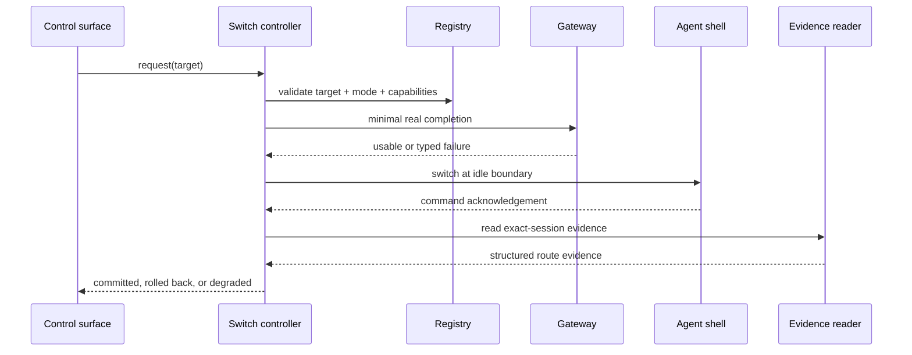

# Architecture

## Problem statement

Most agent shells couple four concerns that should be separable:

1. conversation state,
2. tool execution,
3. provider protocol,
4. model selection.

If the provider also owns the conversation, changing providers means creating a new session and reconstructing state. Same-session switching instead treats the model as a replaceable compute backend while the shell remains the authority for the conversation.

## Components

| Component | Owns | Must not own |
| --- | --- | --- |
| Agent shell | session ID, transcript, tool loop, workspace | provider credentials or fallback policy |
| Protocol gateway | request/response translation, streaming normalization, auth connector | session truth or UI state |
| Model registry | selectable aliases, provider mapping, capabilities, evidence expiry | live credentials or runtime truth |
| Switch controller | validation, probing, idle-boundary dispatch, verification, rollback | transcript content or model implementation |
| Evidence reader | actual model, timestamps, response IDs, failure reason | desired state |
| Control surface | operator intent and transparent status | independent model lists or optimistic success |

## Data flow



## Control plane and data plane

Keep the control plane separate from inference traffic.

- **Data plane:** prompts, streaming deltas, tool calls, usage, and provider responses.
- **Control plane:** registry, desired model, pending switch, negative cache, health evidence, and audit events.

This prevents a failed model response from corrupting desired state and prevents an optimistic UI acknowledgement from becoming runtime truth.

## Registry as the single source of selectable models

The launcher, panel, probe, and controller should all consume one registry. A registry entry is not merely an ID; it is a provider-scoped capability record.

```text
ModelEntry {
  alias
  provider
  upstream_model
  route_id
  transport
  auth_mode
  context_window
  safety_margin_tokens
  supports_tools
  supports_images
  supports_streaming
  reasoning_controls
  evidence_level
  evidence_ref
  verified_at
  evidence_ttl
}
```

Selectability is derived from current, non-expired evidence and the session's required capabilities. A static `switchable: true` flag is not runtime proof.

The control surface may filter the registry, but it must never maintain a second hand-written list.

## Transaction boundaries

A switch has two commit points:

1. **Runtime commit:** exact-session evidence shows the target produced an assistant response.
2. **Persistence commit:** desired state is updated so a later restart selects that target.

Persistence must follow runtime verification. Reversing the order creates a “failed now, broken again after restart” failure.

## Busy-session policy

Switching is a control action, not user content. If the shell is generating, sending the command through the ordinary input path can:

- append text to the prompt buffer,
- open a confirmation menu behind streaming output,
- interrupt a tool call,
- or be interpreted as conversation content.

Use a last-writer-wins pending slot:

```text
on switch_request(target):
  validate_and_probe(target)
  if shell.busy:
    pending := target
    return QUEUED
  apply(target)

on idle_boundary:
  if pending exists:
    target := atomically_claim(pending)
    if probe_evidence_expired(target):
      re_probe(target)
    apply(target)
```

If the operator selects the already-active model while another target is pending, treat it as cancellation of the pending request.

Every request also receives a monotonic revision. Probe, confirmation, and evidence events carry that revision; a slow result from an older request is discarded even if it succeeds.

## Verification

Good evidence, strongest first:

1. model identifier in the assistant response associated with the exact session,
2. model identifier in the exact session transcript,
3. a shell-emitted switch confirmation correlated to the request,
4. gateway request logs correlated by request ID.

Weak signals that must not stand alone:

- dropdown selection,
- desired-state file,
- proxy `/models`,
- process existence,
- a successful command injection,
- the newest transcript by modification time.

Represent runtime truth as a structured record rather than a model-name string:

```text
RouteEvidence {
  alias, provider, upstream_model, transport,
  session_id, request_id, observed_at, expires_at
}
```

The controller commits only when the complete route tuple matches the intended target and the session ID is exact.

## Rollback is also a transaction

After a verification mismatch, dispatch the previous route and verify it using the same evidence rules. If rollback evidence also fails, the system must enter `degraded/actual_unknown`, stop claiming an active model, and require fresh observation. “Rollback command sent” is not “rolled back.”

## Context preflight

Before dispatch, compare estimated transcript, tool schema, system/control material, and reserved output against the verified provider-scoped window with a safety margin. If the target cannot fit, reject or explicitly compact before switching. Changing an alias to advertise an unverified larger window only hides the failure.

## Extension boundary

Adding a provider should not require editing the shell, UI, and controller independently. The adapter implements the contract, the registry declares capabilities, and the evidence suite decides which support level the model earns.
